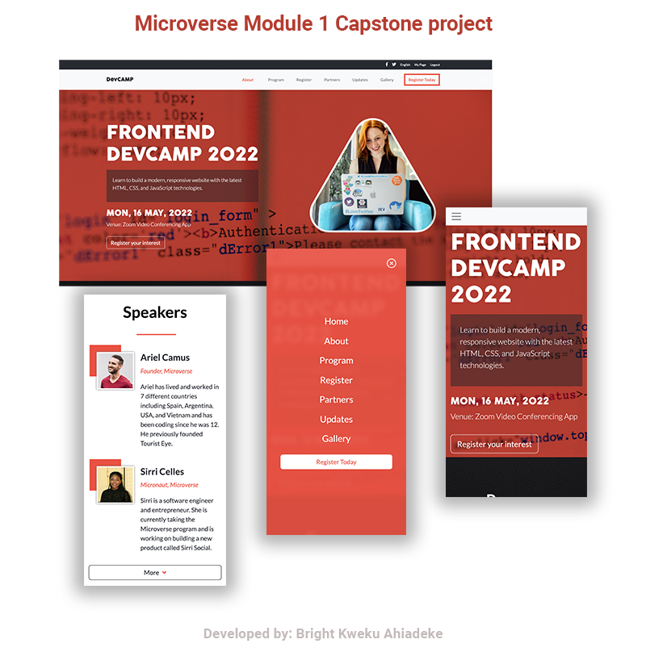

# Capstone Project 1: Responsive Conference Website

> This is my capstone project on HTML-CSS-JAVASCRIPT. I love bootcamp so I have developed this project along that line. The website feature a Virtual Bootcamp called Frontend DevCAMP. It features a list of speakers, an about us page and partner sections. Please have a look at the live demo and let me know what you think 😊.

## Built With

- HTML
- CSS
- JavaScript

## Live Demo

[Live Demo Link](https://kwekubright.github.io/portfolio/)

## Getting Started

To get a local copy up and running follow these simple example steps.

### Usage

- Clone this repository to get started

## Author

👤 **Bright Ahiadeke**

- GitHub: [@kwekubright](https://github.com/kwekubright)
- Twitter: [@twitterhandle](https://twitter.com/kwekubright_)
- LinkedIn: [LinkedIn](https://linkedin.com/in/kwekubright)

## 🤝 Contributing

Contributions, issues, and feature requests are welcome!

Feel free to check the [issues page](../../issues/).

## Show your support

Give a ⭐️ if you like this project!

## Acknowledgments

 Hat tip to:
- @microverseinc
-  Cindy Shin on Behance
- Flaticon.com
- Pexels.com
- Freepik.com
- Fontawesome.com

## 📝 License

This project is [MIT](./MIT.md) licensed.